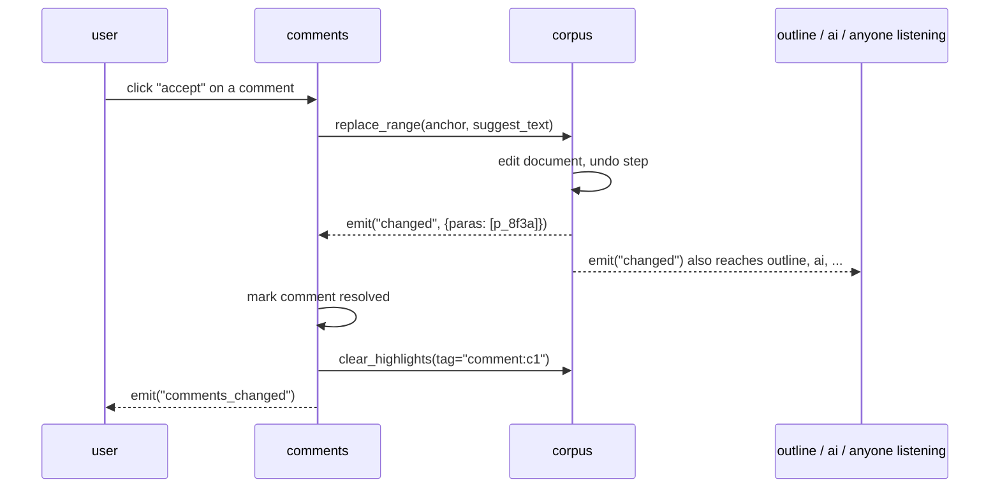

# Modules, the Hub, and Shapes

## What a module is

One folder, one class. It owns a widget, an API, and its save data.

```
modules/comments/
  module.py      # the class below
  widget.py      # Qt UI (optional split, can be one file)
```

```python
class CommentsModule(Module):
    kind     = "comments"                 # type name used in project JSON
    provides = [Comments]                 # shapes this module offers
    needs    = {"target": TextSource}     # role -> shape it requires
    events   = ["comments_changed"]

    def __init__(self, hub, module_id, config): ...
    def widget(self) -> QWidget: ...       # what goes in the slot
    def wire(self, role, other): ...       # hub hands you the module for each need
    def save(self) -> dict: ...            # your chunk of the project file
    def load(self, data: dict): ...

    # --- Comments shape ---
    def get_comments(self) -> list[dict]: ...
    def add_comment(self, anchor, text, suggest=None) -> str: ...
```

Every module gets `hub` in its constructor. That's the only way out.

## The Hub

One object. Small on purpose.

```python
hub.get(module_id)                    -> Module      # look someone up
hub.on(module_id, event, callback)                   # listen
hub.emit(module_id, event, payload)                  # notify (modules call this on themselves)
hub.modules()                         -> dict        # everyone, by id
```

Modules call each other's functions **directly** once wired (`self.target.get_text()`).
The hub only does: registry, wiring + shape check at load, and event fan-out.
No message queue, no RPC layer. Keep it boring.

```
                    ┌──────────────┐
    on("changed") → │              │ ← emit("changed")
      comments      │     HUB      │      corpus
      outline       │  registry    │
      ai            │  events      │
                    │  wiring      │
                    └──────────────┘
                           │
              at load: for every wire, check
              "does the target fit the needed shape?"
```

## Shapes

A shape is a named list of functions + events. Nothing more.

```python
TextSource = Shape("TextSource",
    funcs  = ["get_text", "get_paragraphs", "get_range",
              "replace_range", "resolve_anchor"],
    events = ["changed"],
)

Headings = Shape("Headings",
    funcs  = ["get_headings", "scroll_to", "set_style"],
    events = ["headings_changed"],
)

Selection = Shape("Selection",
    funcs  = ["get_selection"],          # -> anchor or None
    events = ["selection_changed"],
)

Highlights = Shape("Highlights",
    funcs  = ["highlight", "clear_highlights"],
)

Comments = Shape("Comments",
    funcs  = ["get_comments", "add_comment", "resolve_comment"],
    events = ["comments_changed"],
)
```

**A module fits a shape if it has every function and declares every event in
it.** Names are labels; the check is on the functions. So a module that never
heard of `TextSource` but happens to have those five functions fits it. (This
is duck typing with a checklist.)

## Compatibility = does A provide what B needs

```
   corpus provides                     comments needs
   ┌────────────┐                      ┌────────────┐
   │ TextSource │ ────────────────────▶│ TextSource │   ✓ one-way: comments → corpus works
   │ Headings   │                      └────────────┘
   │ Selection  │
   │ Highlights │                      outline needs
   └────────────┘                      ┌────────────┐
         ▲─────────────────────────────│ Headings   │   ✓
                                       │ Selection  │
                                       └────────────┘
   notes provides                      comments needs
   ┌────────────┐                      ┌────────────┐
   │ TextSource │ ────────────────────▶│ TextSource │   ✓ comments can target a note too
   └────────────┘                      └────────────┘
                                       ┌────────────┐
                              ✗ ───────│ Highlights │   ✗ unless notes grows highlight()
                                       └────────────┘
```

- **One-way compatible**: B's `needs` ⊆ A's `provides`. B can be wired to A.
- **Two-way compatible**: both directions hold. Rare and not special; it's
  just two wires.
- A module with `needs = {}` (corpus, notes) can be dropped in anywhere.

The hub checks this once, at load. On failure it says exactly what's missing:

```
wire error: comments.target -> notes
  needs Highlights, notes is missing: highlight, clear_highlights
```

## Wiring in JSON

Wiring lives with the module instance in the project file:

```json
"modules": {
  "main":     { "kind": "corpus" },
  "notes":    { "kind": "notes" },
  "outline":  { "kind": "outline",  "wire": { "source": "main" } },
  "comments": { "kind": "comments", "wire": { "target": "main" } }
}
```

`wire` keys are the module's `needs` roles; values are module ids. Point
`comments.target` at a second corpus and you have comments on chapter 2. No
code change.

## Anchors

Anything that points into text uses this:

```json
{ "para": "p_8f3a", "start": 12, "end": 40, "quote": "the quick brown fox" }
```

- `para`: stable paragraph id. Assigned when a paragraph is created, never
  changes, survives save/load.
- `start`/`end`: character offsets inside that paragraph.
- `quote`: the text at the time the anchor was made. If the offsets no longer
  match (text edited while the module wasn't watching), the corpus searches
  the paragraph for `quote` and re-anchors. If it's gone, the anchor is
  reported as **orphaned** and the owning module decides what to show.

While the app is running, the corpus keeps live `QTextCursor`s behind each
anchor so they track edits automatically. The JSON form is only for saving.

## How a talk actually goes: accepting a suggested edit



Nothing here required corpus to know what a comment is. That's the point: a
future AI module does the exact same calls.

## Rules of thumb for writing a module

1. Never import another module's class. Only talk through the wired object
   and hub events.
2. Every function in a shape must work when called from anyone, any time.
   Don't assume the caller is the UI.
3. `save()` returns plain dicts/lists/strings. No Qt objects.
4. If you want data from another module, ask it (`get_*`). Don't cache it,
   subscribe to its `changed` event and re-ask.
5. Keep shapes small. If a shape needs 10 functions, it's two shapes.
